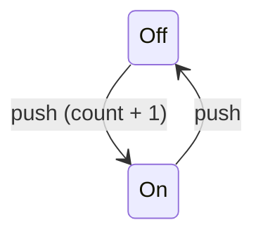
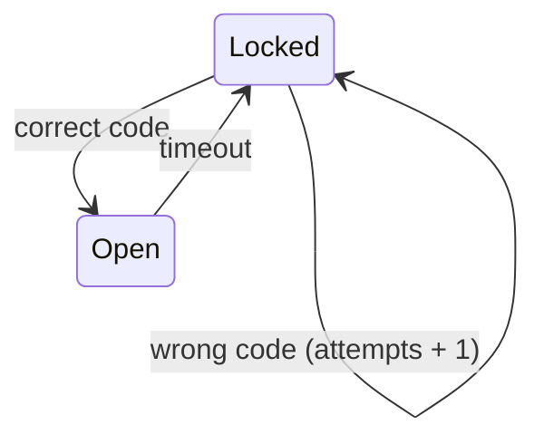

# Examples

Runnable example projects for the `eparch` library. Each example is a self-contained Gleam project with unit / integration tests.

```sh
cd examples/<example>
gleam test
```

## State Machine (`gen_statem`)

| Example | Concepts demonstrated |
|---|---|
| [`01-push-button`](./01-push-button/) | Basic state transitions, synchronous calls, press counter |
| [`02-door-lock`](./02-door-lock/) | `with_state_enter`, `StateTimeout` for auto-lock, wrong-code tracking |

### Push-Button

The canonical OTP `gen_statem` [example from the official docs](https://www.erlang.org/doc/apps/stdlib/gen_statem.html#module-pushbutton-state-diagram). 

- A button toggles between `Off` and `On`.
- Only `Off -> On` transitions increment the press counter.



### Door Lock

A code-protected door lock. 

- Entering the correct code opens the lock. 
- The door auto-relocks after a configurable timeout via `StateTimeout`.
- Demonstrates `with_state_enter` to arm the timer on every entry to the `Open` state.



## `eparch/gen_event`

Coming soon.
